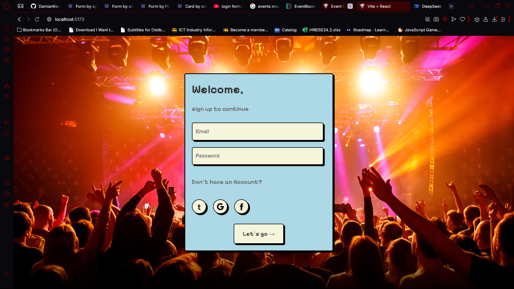
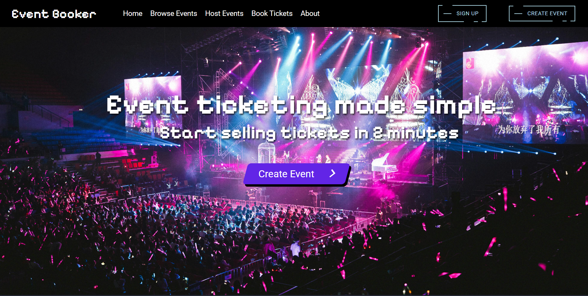
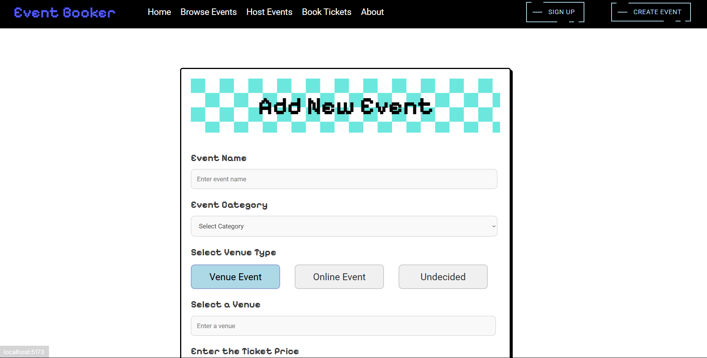

# Event-Booking-Website-

Event Booking website we made for our Enterprise Application Development project. It is a website where you can add your own events and also be able to book other events. The website is connected to a backend which uses springboot to connect to the front end and use services.

Features:

- Create account as user
- Create your own events
- Book other events
- Edit existing events
- Edit Account
- Browse Events

Dashboard:

Add Event:

